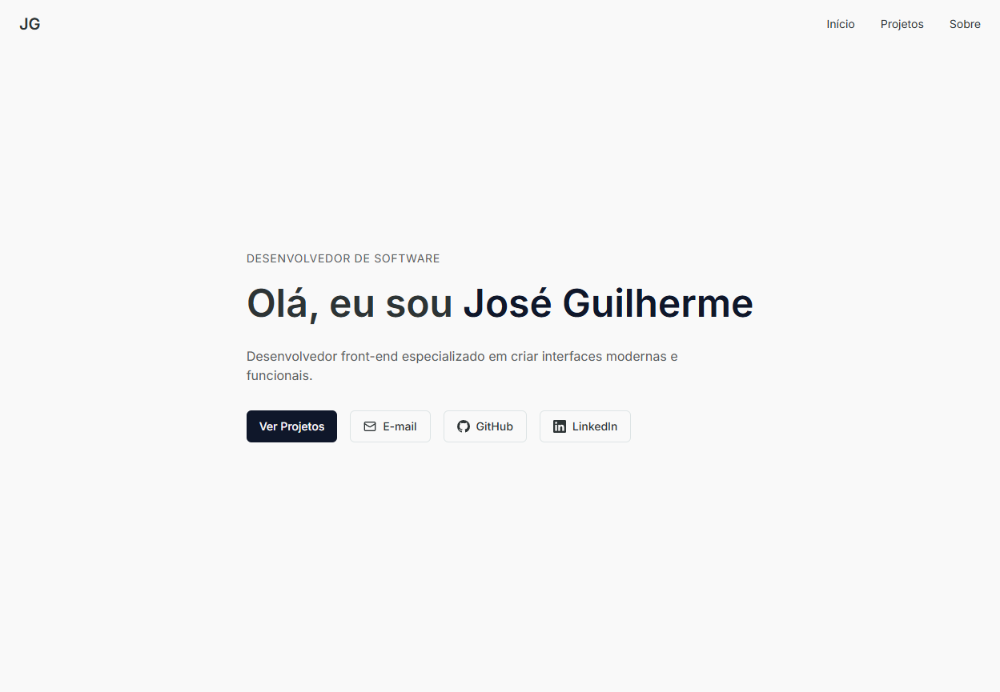

<h1 align="center">
  Portfolio
</h1>



<div align="center">
  <a href="README-en.md">English</a>
  ·
  <a href="README.md">Português</a>
</div>

## 💬 Description

This is my online portfolio! I'm a front-end developer specialized in creating modern and functional interfaces. Here you can learn more about me, my main projects, and how to get in touch.

## 🚀 Technologies

### Front-end

- [NextJS](https://nextjs.org/) - Framework (based on [ReactJS](https://react.dev/)) used for building interfaces
- [TypeScript](https://www.typescriptlang.org/) - Package that adds static typing to JavaScript
- [Google Fonts](https://fonts.google.com/) - Library containing various fonts
- [Tailwind CSS](https://tailwindcss.com/) - CSS framework for styling

## 🚀 Getting Started

First of all you need to have `node` and `yarn` (or `npm`) installed on your machine.

_If you decide to use npm, don't forget to delete `yarn.lock` in the folders._

Then you can clone the repository.

```code
  git clone https://github.com/zehguilherme/portfolio
```

Start the application

1. `yarn` or `npm install`
2. `yarn dev` or `npm run dev`

## 🤔 How to contribute

1. Fork the project;
2. Create a branch with your feature: `git checkout -b my-new-feature`;
3. Commit your changes: `git commit -m 'feat: Add new feature'`;
4. Push to the branch: `git push origin my-new-feature`;
5. Create a new Pull Request;
6. After your Pull Request is merged, you can delete your branch.

---

Made with 💟 by José Guilherme Paro Monteiro Tomaine 👋 [Talk to me!](https://www.linkedin.com/in/jos%C3%A9-guilherme-paro-monteiro-tomaine/)
